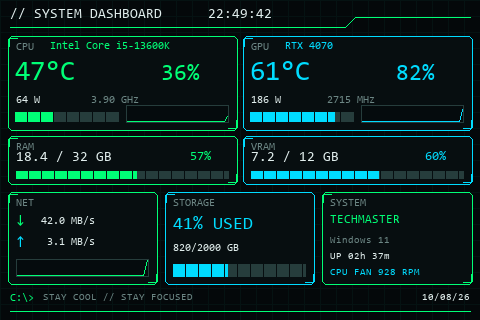
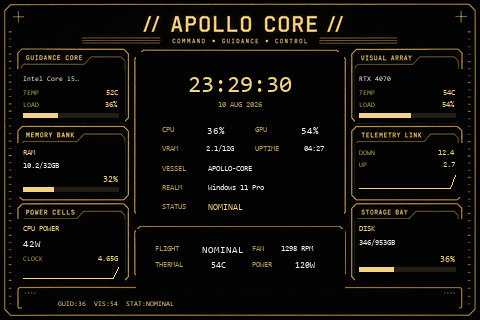
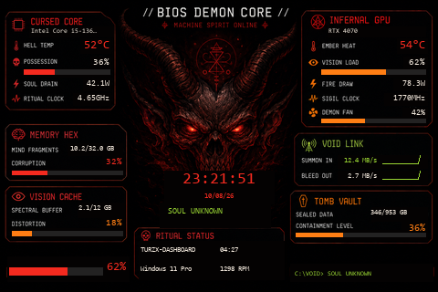

# TURZX Dashboard

A lightweight **480×320 hardware monitor** for the **UsbPCMonitor / TURZX-style 3.5" display (Hardware Revision A)**.

This project is intentionally small: it keeps only the components required to drive the 3.5" serial display and collect system telemetry on Windows.

> [!IMPORTANT]
> This project is **not affiliated with TURZX, Turing, XuanFang, UsbPCMonitor, or their manufacturers/sellers**.

## Themes

Several dashboard styles are available.

### Cyber Dashboard

The original cyber-style dashboard with green/cyan telemetry, compact system panels and partial LCD updates.

<p align="center">
  
</p>

Run:

```powershell
python turzx_dashboard.py --com COM3
```

---

### Apollo Core

A retro **Apollo / NASA mission-control inspired** theme with amber instrumentation, guidance-style panels and a clean avionics look.

<p align="center">
  
</p>

Run:

```powershell
python turzx_dashboard_apollo.py --com COM3
```

---

### BIOS Demon Core

A darker illustrated theme inspired by a corrupted BIOS / occult terminal interface.

<p align="center">
  
</p>

Run:

```powershell
python turzx_dashboard_demon.py --com COM3
```

---

## Features

All themes use the same telemetry backend and support:

- CPU usage
- CPU package temperature
- CPU package power
- CPU clock
- CPU fan speed when exposed by LibreHardwareMonitor
- NVIDIA GPU usage
- GPU temperature
- GPU power
- GPU clock
- VRAM usage
- RAM usage
- Network throughput
- Storage usage
- Hostname
- Windows version
- System uptime
- Live clock
- Partial LCD updates to reduce unnecessary serial traffic

## Hardware tested

- **Display:** UsbPCMonitor 3.5"
- **Hardware revision:** Rev A / `USBMONITOR_3_5`
- **Native resolution:** 320×480
- **Dashboard orientation:** 480×320 landscape
- **Connection:** USB serial / COM port

The display port can be detected automatically or specified manually.

## Requirements

Windows and Python 3.10+ are recommended.

```text
pyserial~=3.5
psutil~=7.2.2
Pillow~=12.3.0
numpy~=2.4.4
pythonnet~=3.0.5
nvidia-ml-py
```

NVIDIA telemetry is read through NVML.

CPU temperature, package power and fan telemetry are read through **LibreHardwareMonitor**.

On Windows, running the program or PyCharm with administrator privileges may be required for full hardware sensor access.

## Installation

Clone the repository and create a virtual environment:

```powershell
git clone https://github.com/MaarekXL/Turzx_dashboard.git
cd Turzx_dashboard

python -m venv .venv
.\.venv\Scripts\Activate.ps1

python -m pip install --upgrade pip
pip install -r requirements.txt
```

Close the original `UsbPCMonitor.exe` application before starting the dashboard so it does not keep the COM port open.

## Usage

### Automatic COM-port detection

```powershell
python turzx_dashboard.py
```

### Specify the display port manually

```powershell
python turzx_dashboard.py --com COM3
```

### Generate a preview without writing to the LCD

```powershell
python turzx_dashboard.py --preview
```

### Generate a preview using live system sensors

```powershell
python turzx_dashboard.py --live-preview
```

### Set brightness

```powershell
python turzx_dashboard.py --brightness 30
```

### Set refresh period

```powershell
python turzx_dashboard.py --refresh 1.0
```

The same command-line options are available for the theme variants unless otherwise noted.

## Project structure

```text
TURZX-Dashboard/
├── external/
│   ├── LibreHardwareMonitor/
│   └── PawnIO/
│
├── library/
│   ├── lcd/
│   │   ├── color.py
│   │   ├── lcd_comm.py
│   │   ├── lcd_comm_rev_a.py
│   │   └── serialize.py
│   ├── LICENSE
│   └── log.py
│
├── LICENSE
├── requirements.txt
│
├── turzx_dashboard.py
├── turzx_dashboard_apollo.py
├── turzx_dashboard_demon.py
│
├── apollo_background.png
├── demon_background.png
│
├── preview.png
├── preview_apollo.png
├── preview_demon.png
│
└── README.md
```

## Design

The dashboards are rendered directly with Pillow at **480×320**.

The LCD is **not** used as a Windows secondary monitor. Frames are sent directly through the display protocol over USB serial.

After the initial full frame, the program compares dynamic regions against the previous frame and only sends changed image patches.

This reduces USB/serial traffic compared with continuously transmitting the complete display.

## Credits and upstream project

This project is based on and reuses portions of:

**[turing-smart-screen-python](https://github.com/mathoudebine/turing-smart-screen-python)**

Original project by **Matthieu Houdebine ([@mathoudebine](https://github.com/mathoudebine)) and contributors**.

`turing-smart-screen-python` provides the open-source display communication layer and hardware abstraction used as the foundation for this project.

This repository is a specialized, stripped-down dashboard for the **UsbPCMonitor 3.5" Rev A** and is not intended to replace the full upstream project.

For support for other display revisions, models, themes, operating systems and upstream functionality, use the original project.

## Third-party components

This repository may include components from:

- `turing-smart-screen-python`
- LibreHardwareMonitor
- HidSharp / related LibreHardwareMonitor dependencies
- PawnIO

Their respective notices and licenses must be preserved where applicable.

## License

The portions derived from **turing-smart-screen-python** remain subject to its **GNU General Public License v3.0** terms.

See [`LICENSE`](LICENSE) and the retained upstream license notices for details.

## Acknowledgements

Thanks to **Matthieu Houdebine and all contributors to turing-smart-screen-python** for reverse-engineering, maintaining and documenting support for these inexpensive USB smart displays.
